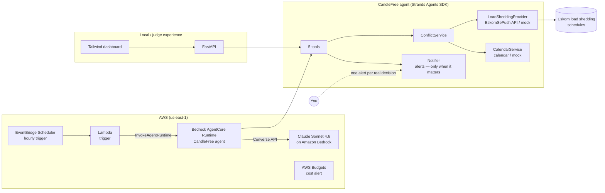

# CandleFree ⚡

**An autonomous load shedding life-manager agent for South Africa** — built with the
[Strands Agents SDK](https://strandsagents.com) for the AWS *Agents for Humans* Hackathon.

## The problem
Load shedding disrupts millions of South Africans daily. Meetings drop mid-call, plans
collapse, and everyone burns time cross-checking outage schedules against their day.

## Who it's for
Remote workers, students, and small businesses in South Africa who live around
Eskom's load shedding schedule.

## Why it matters
CandleFree runs silently in the background: it watches your area's schedule
(EskomSePush API), detects when outages clash with your online meetings,
**autonomously reschedules them to power-safe slots**, and only surfaces when a real
decision is needed. No new app to manage — your day just quietly keeps working.

## Architecture (SOLID)
```
src/candlefree/
├── domain/       # Pure pydantic models (no I/O)
├── interfaces/   # ABCs: LoadSheddingProvider, CalendarService, Notifier (DIP)
├── providers/    # EskomSePush client + mocks (LSP-substitutable)
├── services/     # ConflictService business logic (SRP)
├── agent/        # Strands tools, AgentFactory, DI container (composition root)
└── api/          # FastAPI surface
```

## Architecture diagram



**Flow:** every hour EventBridge fires a Lambda that invokes the CandleFree agent on
Bedrock AgentCore. The agent (Strands SDK + Claude Sonnet 4.6) pulls the load shedding
schedule for your area, scans your calendar for meetings that collide with outages,
autonomously reschedules them into power-safe slots, and surfaces a single alert only
when a human decision is genuinely required.

## Quickstart (no AWS account needed — demo mode)

Requires Python 3.10+.

```powershell
# Windows PowerShell
python -m venv .venv
.venv\Scripts\Activate.ps1
pip install -e .[dev]

# macOS/Linux: python3 -m venv .venv && source .venv/bin/activate && pip install -e .[dev]

# Run tests
pytest

# Run the API (demo mode is on by default — mock schedule & calendar, no API keys)
uvicorn candlefree.api.main:app --port 8000
```

Then:
- `GET /health` — liveness
- `GET /schedule` — current stage + outage windows
- `GET /conflicts` — meetings clashing with outages
- `POST /agent/run` — one autonomous agent pass (**requires AWS credentials**, see below)
- `GET /alerts` — what the agent chose to surface

## Running the full agent (AWS required)

`POST /agent/run` invokes Claude Sonnet 4.6 on Amazon Bedrock (region `us-east-1`):

1. Configure AWS credentials (`aws login` or `aws configure`)
2. First-time Anthropic users: submit the one-time use case form (Bedrock console → Model catalog → open Claude in the playground and follow the prompt)

## Deploying to Bedrock AgentCore

The `candlefree/` subfolder is an [AgentCore CLI](https://www.npmjs.com/package/@aws/agentcore) project (CodeZip build, HTTP protocol):

```powershell
npm install -g @aws/agentcore
cd candlefree
agentcore deploy          # deploys runtime via CDK
agentcore invoke "Run your background check now."
```

## Autonomous background runs (Terraform)

`terraform/` provisions an EventBridge schedule → Lambda → `InvokeAgentRuntime` loop plus a monthly cost budget alert:

```powershell
cd terraform
copy terraform.tfvars.example terraform.tfvars   # fill in your runtime ARN + email
terraform init
terraform apply
```

## Live load shedding data

Set `CANDLEFREE_DEMO_MODE=false` and provide `CANDLEFREE_ESP_API_KEY`
([EskomSePush API](https://eskomsepush.gumroad.com/l/api)) plus your `CANDLEFREE_ESP_AREA_ID` in `.env` (copy `.env.example`).
The dashboard's area search then returns real EskomSePush areas; in demo mode it falls
back to OpenStreetMap place suggestions.

## License

[MIT](LICENSE)
